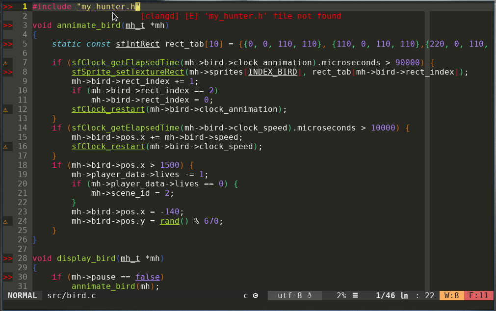
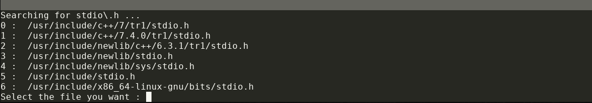

# Vim Goto-Header
Vim Goto-Header is a plugin I made to quickly jump to header files with vim/neovim.\
It can also be used to jump back and forth between .c/.h or .cpp/.hpp.\
It can be use for both c or cpp.

Example :\


## Dependencies
Goto-Header uses [fd](https://github.com/sharkdp/fd) (a find alternative) to look for headers.\
To install it on your system see : https://github.com/sharkdp/fd#installation \

## Installation

### Using Plug
```
Plug 'Yohannfra/Vim-Goto-Header'
```

### Manual installation
```
git clone https://github.com/Yohannfra/Vim-Goto-Header/ ~/.vim/plugin/
```

## Configuration

### How to open the file
By default the file you open will be in the same tab.\
If you want to open the file in a new tab put this in your .vimrc
```vim
let g:goto_header_open_in_new_tab = 1
```

#### Directories
By default the script will look in those directories (in this order):
- .
- /usr/include
- ..
- ~

To change the directories or the order you put this in your .vimrc
```vim
let g:goto_header_includes_dirs = ["DIR1", "DIR2", "DIR3.", "DIR4"]

" example:
let g:goto_header_includes_dirs = [".", "/usr/include", "..", "~"]
```
#### Exclude Directories (ONLY IF YOU USE FD)
If you want to exclude directories from the search path.\
Put this in your .vimrc
```vim
let g:goto_header_excludes_dirs = ["DIR1", "DIR2", "DIR3", "DIR4"]

" example
" It uses the exclude feature of fd, dont put full path , just the directory name.

" Good
let g:goto_header_excludes_dirs = ["Music", "Logiciels", "Pictures", "Downloads"]

" Bad
let g:goto_header_excludes_dirs = ["~/Music", "~/Logiciels", "~/Pictures", "~/Downloads"]
```
#### Flags

fd uses -L flag (follow symlink). You can't change it using the following lines, it must stay.

You can customize other fd flags by putting this in your .vimrc
```vim
let g:goto_header_fd_command = "-t f -s" " Use any flag you want except -L
```

#### Prompt

If you want to print a shorter path in the prompt (usefull if your have a small terminal window)
```vim
g:goto_header_use_shorter_path = 1
```

#### By default

The default configuration is the following one:
```vim
let g:goto_header_includes_dirs = [".", "/usr/include", "..", "~"]
let g:goto_header_search_flags = "-t f -s"
let g:goto_header_excludes_dirs = []
let g:goto_header_open_in_new_tab = 0
let g:goto_header_use_shorter_path = 0
```

## Usage

Put the following lines in your .vimrc to map F12 to search header under the cursor
```vim
nnoremap <F12> :GotoHeader <CR>
imap <F12> <Esc>:GotoHeader <CR>
```

Put the following lines in your .vimrc to map gh to switch between .c/.h or .cpp/.hpp
```vim
nnoremap gh :GotoHeaderSwitch <CR>
```

If you need to switch between a ".cpp" file and a ".h" file (like in #2) add this to your .vimrc
```vim
let g:goto_header_associate_cpp_h = 1
```

Now you'll just need to press F12 on a line like one of those and it will open the corresponding file in a new tab
```c
#include <stdio.h>
#include "my_header.hpp"
```

If Vim Goto-Header finds more than one header it will show you a little prompt and you'll have
to chose which one.



## License

This project is licensed under the terms of the MIT license.
